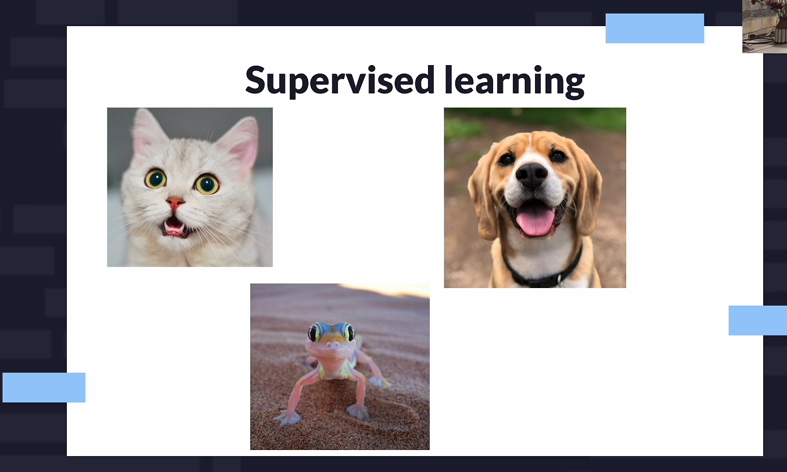
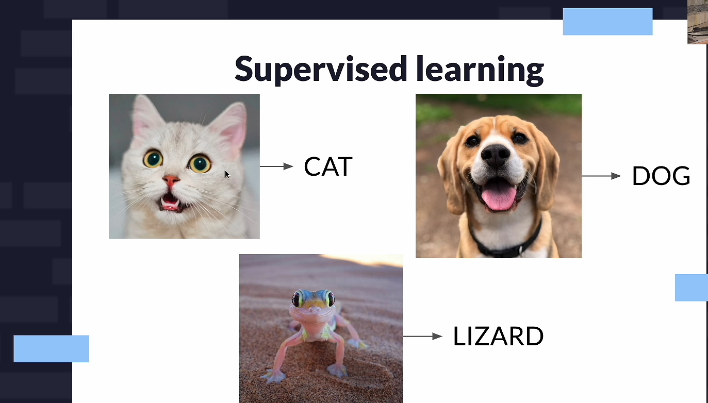
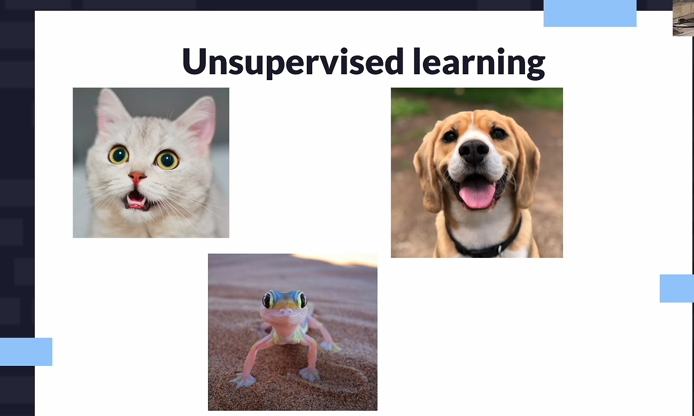
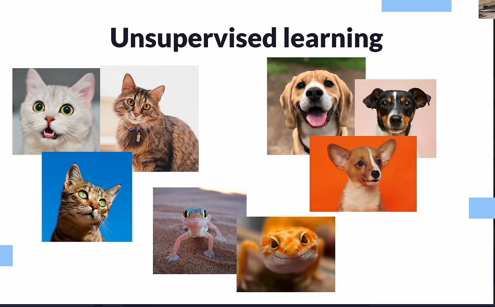
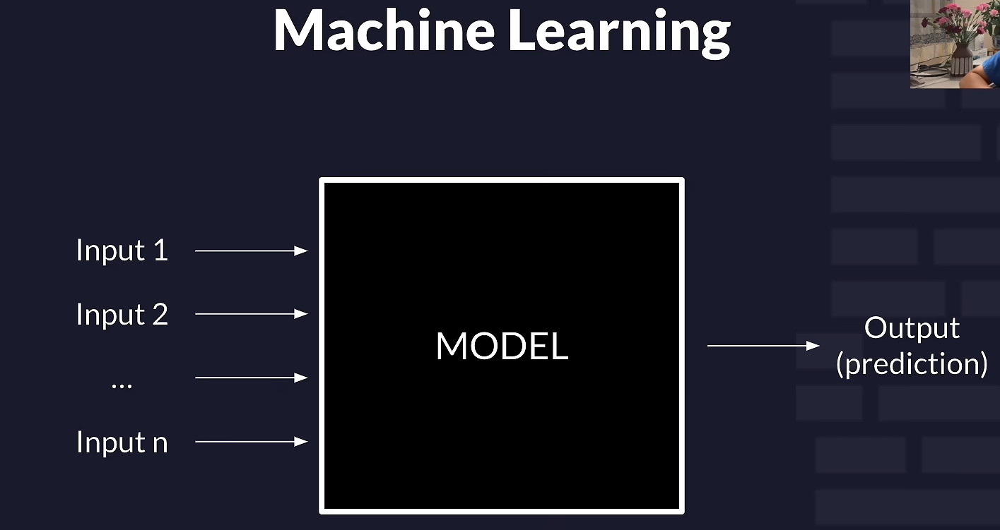
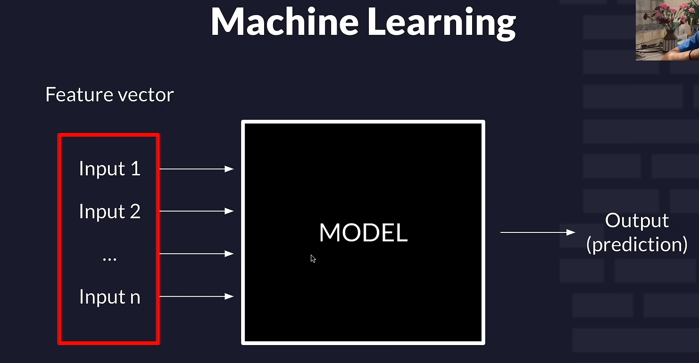

# Machine Learning Fundamentals

## What is Machine Learning?

**Machine Learning (ML)** is a subfield of Computer Science and Artificial Intelligence that focuses on developing algorithms that enable computers to **learn patterns from data and make predictions or decisions without being explicitly programmed for every possible case**.

In traditional programming:

> **Rules + Data → Output**

In Machine Learning:

> **Data + Expected Outputs → Learned Model**

The learned model can then be used to make predictions on new, unseen data.

---

# AI vs ML vs Data Science

### Artificial Intelligence (AI)

**Artificial Intelligence** is a broad field of Computer Science that aims to enable computers and machines to perform tasks that typically require human-like intelligence, such as reasoning, perception, language understanding, planning, and decision-making.

### Machine Learning (ML)

**Machine Learning is a subset of AI** that uses data and algorithms to learn patterns and make predictions or decisions without explicitly programming all the rules.

### Data Science (DS)

**Data Science** is a broader field that focuses on collecting, cleaning, analyzing, and interpreting data to discover patterns, generate insights, and support decision-making.

Data Science **may use Machine Learning**, but ML is not required for every Data Science task.

### Relationship

```text
Artificial Intelligence
│
└── Machine Learning
    │
    └── Deep Learning
```

Data Science overlaps with AI/ML but is not simply a subset of AI.

---

# Types of Machine Learning

There are three major types of Machine Learning:

## 01. Supervised Learning

**Supervised Learning** uses **labeled data**, meaning each input has a corresponding known output (label).

The model learns the relationship between the inputs and outputs and uses that relationship to make predictions on new data.






### Example

Suppose we have data about houses:

```text
Size    Bedrooms    Location    Price
1200      3          Dhaka      80 Lakh
1500      4          Dhaka      100 Lakh
1000      2          Khulna     50 Lakh
```

Here:

- **Features:** Size, Bedrooms, Location
- **Label / Target:** Price

The model learns from existing examples and predicts the price of a new house.

---

## 02. Unsupervised Learning

**Unsupervised Learning** uses **unlabeled data**. There is no predefined target or output label.

The model attempts to discover hidden patterns, structures, relationships, or groups within the data.





### Example

Suppose an e-commerce company has customer data:

```text
Age    Income    Purchases
22      25k         5
25      30k         8
45      100k       25
50      120k       30
```

There is no predefined customer category.

An unsupervised learning algorithm could discover groups such as:

```text
Group 1 → Younger / lower spending customers
Group 2 → Older / higher spending customers
```

A common unsupervised learning technique is **clustering**.

---

## 03. Reinforcement Learning

**Reinforcement Learning (RL)** is a type of Machine Learning in which an **agent learns by interacting with an environment**.

The agent takes actions and receives:

- **Rewards** for desirable actions
- **Penalties / negative rewards** for undesirable actions

The goal is to learn a strategy (policy) that maximizes the **cumulative reward** over time.


### Example

A game-playing AI:

```text
Agent → takes action → Environment
  ↑                         │
  └──── reward / penalty ───┘
```

The agent gradually learns which actions lead to better outcomes.

---

# Supervised Learning

Supervised Learning can be understood as learning a mapping:

```text
Input Features → Model → Prediction
```

For example:

```text
House Features → ML Model → Predicted Price
```



---

# Features

A **feature** is an individual measurable property or characteristic of an observation that is used as an input to a Machine Learning model.

### Example

For predicting house prices:

```text
Size       → Feature
Bedrooms   → Feature
Age        → Feature
Location   → Feature

Price      → Target / Label
```

A dataset usually contains many observations, and each observation contains multiple features.

---

## Types of Features / Data

Features can broadly be divided into:

1. **Qualitative (Categorical)**
2. **Quantitative (Numerical)**

---

# 01. Qualitative / Categorical Data

**Categorical data** represents values that belong to a finite set of categories or groups.

Examples:

```text
Country → USA, India, Canada, France
Color   → Red, Blue, Green
Gender  → Male, Female
```

Categorical data can be further divided into **nominal** and **ordinal** data.

---

## Nominal Data

**Nominal data** consists of categories that have **no inherent order or ranking**.

Example:

```text
Country:
USA
India
Canada
France
```

There is no meaningful ordering such as:

```text
USA > India > Canada
```

The categories are simply different.

---

# One-Hot Encoding

Machine Learning models generally work with numerical representations.

**One-Hot Encoding** converts categorical values into binary vectors, where each category is represented by a separate column.

Suppose:

```text
[USA, India, Canada, France]
```

The encoding becomes:

```text
USA     → [1, 0, 0, 0]
India   → [0, 1, 0, 0]
Canada  → [0, 0, 1, 0]
France  → [0, 0, 0, 1]
```

A value of `1` indicates that the observation belongs to that category, while `0` indicates that it does not.

> **Important:** One-hot encoding avoids falsely implying an ordering between nominal categories.

---

# Ordinal Data

**Ordinal data** consists of categories that have a meaningful **inherent order or ranking**, but the difference between categories may not be numerically equal.

Example:

```text
Education Level:

High School < Bachelor's < Master's < PhD
```

Another example:

```text
Satisfaction:

Poor < Average < Good < Excellent
```

The order matters, unlike nominal data.

---

# 02. Quantitative / Numerical Data

**Quantitative data** represents numerical values that can be measured or counted.

Examples:

```text
Age
Height
Weight
Salary
Number of purchases
Temperature
```

Quantitative data can be divided into:

### Discrete Data

Values that are **countable** and usually represented by whole numbers.

Examples:

```text
Number of students = 50
Number of cars = 4
Number of purchases = 12
```

### Continuous Data

Values that can take any value within a range and can be measured with increasing precision.

Examples:

```text
Height = 171.5 cm
Weight = 71.2 kg
Temperature = 36.7°C
```



---

# Feature Vector

A **feature vector** is a numerical representation of the features of a single observation.

For example, suppose we want to represent a house using:

```text
Size = 1200 sq ft
Bedrooms = 3
Age = 5 years
```

Its feature vector could be:

```text
X = [1200, 3, 5]
```

For another house:

```text
X = [1500, 4, 2]
```

In Machine Learning, the model generally receives these feature vectors as its input.

### In mathematical notation

```text
X = [x₁, x₂, x₃, ..., xₙ]
```

where each `xᵢ` represents one feature.

> A dataset can therefore be represented as a matrix where **rows are observations and columns are features**.

---

# Labels / Targets

A **label** or **target** is the value that a supervised learning model is trained to predict.

Example:

```text
Features                     Target
-----------------------------------------
Size     Bedrooms    Age      Price
1200        3         5       80 Lakh
1500        4         2       100 Lakh
1000        2         8       50 Lakh
```

Here:

```text
Features → Size, Bedrooms, Age
Target   → Price
```

For classification, the target is usually a category.

For regression, the target is usually a numerical value.

---

# Types of Prediction

Supervised Learning tasks are mainly divided into:

1. **Classification**
2. **Regression**

---

# Supervised Learning Tasks

## 01. Classification

**Classification** is a supervised learning task where the model predicts a **discrete class or category**.

Examples:

```text
Email → Spam / Not Spam

Image → Cat / Dog

Patient → Disease / No Disease

News → Fake / Real
```

The output belongs to one or more predefined categories.

---

## Binary Classification

**Binary Classification** is a classification problem where there are **exactly two possible classes**.

Examples:

```text
Spam        / Not Spam
Fake        / Real
Pass        / Fail
Disease     / No Disease
```

Example:

```text
Input → Email
Output → Spam
```


---

## Multiclass Classification

**Multiclass Classification** is a classification problem where there are **more than two possible classes**, and the model selects one of those classes.

Example:

```text
Animal Image
     ↓
┌─────────────┐
│ Cat         │
│ Dog         │
│ Horse       │
│ Bird        │
└─────────────┘
```

Another example:

```text
Digit Image → 0, 1, 2, 3, ..., 9
```

---

## Binary vs Multiclass Classification

| Aspect | Binary Classification | Multiclass Classification |
|---|---|---|
| Number of classes | Exactly 2 | More than 2 |
| Output | One of two classes | One of multiple classes |
| Example | Spam / Not Spam | Cat / Dog / Horse |
| Example target | `0` or `1` | `0`, `1`, `2`, ... |
| Main goal | Distinguish between two classes | Distinguish between multiple classes |

### Simple way to remember

```text
Binary       → 2 classes

Multiclass   → 3+ classes
```

---

# 02. Regression

**Regression** is a supervised learning task where the model predicts a **continuous numerical value**.

Examples:

```text
House → Predicted Price
Car → Predicted Resale Value
Weather → Predicted Temperature
Employee → Predicted Salary
```

For example:

```text
House Features
      ↓
   ML Model
      ↓
Predicted Price = 85.5 Lakh
```

### Classification vs Regression

```text
Classification → Predict a category

Regression     → Predict a numerical value
```

---

